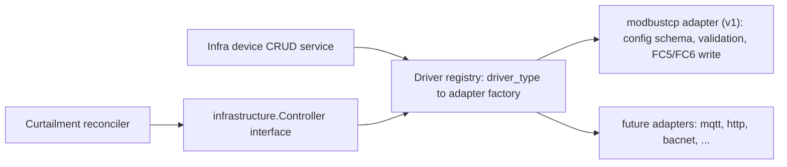
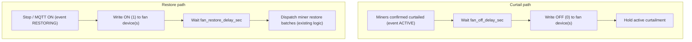

# Facility Fan Curtailment Integration

## Summary

Give curtailment response profiles the ability to coordinate facility fans
with miner curtailment. When miners are curtailed, the facility fan (or fan
group) is turned off after a configurable delay. On restore, the fan is
turned on first, and miners are restored after a configurable delay.

To support this, infrastructure devices (fans and fan groups behind a PLC)
become a persisted, first-class concept with add/edit UI, and the server
gains a protocol-agnostic driver adapter layer whose first implementation is
a Modbus TCP on/off (0/1) write.

## Target hardware and integration contract

- The site fans are driven by Eaton H-Max HVAC variable frequency drives,
  which support Modbus TCP. Run/stop is controlled through the drive control
  word (address `2001`, commonly referenced as holding register `42001`,
  bit `B0`); a speed reference exists at address `2003` (scaled `0..10000`
  for `0..100%`) for future speed control.
- The operator reports the PLC integration in front of the fans is
  deliberately simple: on/off, i.e. writing `0` or `1`.
- Because the exact write target may vary per site (direct to drive vs.
  through the PLC), the register address and write mode (coil vs. holding
  register) are per-device configuration, not code.

## Hardware review findings and gaps

Findings from reviewing the plan against the Eaton H-Max application manual
(MN04008006E) and the operator's description of the fan integration.

### Verified against the manual

- Register map is correct: FB Control Word at application address `2001`
  (16-bit holding area), FB Speed Reference at `2003` (scaled `0..10000`),
  FB Status Word at `2101` (start of the FBProcessDataOUT range used by the
  v2 read-back). The simpler coil `0001` (RUN/STOP, control word bit 0) is
  also available and fits the configurable `write_mode`.
- Per-device register address + write mode is the right shape: it absorbs
  the direct-to-drive vs. behind-PLC variance and Modbus's off-by-one
  addressing conventions (the manual notes holding register `40001` is
  addressed as register `0000` on the wire), turning both into commissioning
  details instead of code.
- Coil functions (FC1/FC5) are TCP-only on the H-Max per its
  supported-functions table. No impact on v1 (Modbus TCP), but relevant if
  the future Modbus RTU / fleetnode work targets the drive's coil map —
  RTU would have to use holding-register writes.

### Gap 1: drive-side commissioning prerequisites (must document)

The plan assumes the drive obeys fieldbus writes, but that requires
drive-side configuration:

- Remote control place must be set to fieldbus control
  (`START SRC AUTO` → Fieldbus); otherwise the drive ignores the control
  word and follows local keypad/analog inputs.
- The H-Max has a communication time-out parameter that faults the drive
  when the fieldbus master goes quiet. With write-once-at-transition
  sequencing, the drive could fault between our writes. Each site must
  either set the comm timeout to `0` (not used) or the server must poll.

These become a per-site commissioning checklist that gates enabling
automatic fan writes (Phase 5) for that site:

1. Fieldbus control place set (`START SRC AUTO` → Fieldbus).
2. Comm timeout set to `0` (not used). Gap 2's re-assertion acts as a
   fieldbus keepalive only while an event is in a fan phase — between
   events the link is quiet, so a nonzero comm timeout would fault the
   drive during normal operation until v2 status polling lands.
3. Write target verified on the live drive/PLC: confirm the configured
   register/coil and write mode produce clean run/stop transitions,
   including that a whole-register `0`/`1` control-word write is acceptable
   for the site's drive configuration (coil `0001` writes only bit 0 and
   sidesteps the question where available).
4. Server-to-device network reachability confirmed (see the Phase 4
   precondition).

### Gap 2: one-shot writes don't survive device restarts (design change)

Stamping `fan_off_sent_at` / `fan_on_sent_at` gates each write to exactly
once per phase. If a drive or PLC power-cycles mid-phase, it may come back
in its default state: fan back on during curtailment silently degrades the
power savings; a fan that drops off during restore is never re-commanded
on, which is the dangerous direction. Since the reconciler already runs a
30s loop and the writes are idempotent, the reconciler should **re-assert
the desired fan state every cycle while a fan phase is active** — the
timestamp gates only the *first* write (delay handling and miner-restore
gating are unchanged); subsequent cycles keep asserting the same state.
This also serves as the fieldbus keepalive from Gap 1. Phase 5 reflects
this.

### Watch items (not v1 requirements)

- No anti-short-cycle protection: recurtail resets the fan phase fields, so
  rapid curtail/restore sequences could toggle a fan quickly. Curtailment
  cadence makes this unlikely; revisit if operators report rapid cycling
  (mitigation would be a minimum dwell time between fan state changes).

## Decisions

1. **Pluggable driver adapters, Modbus TCP first.** The core stores a
   `driver_type` string and an opaque `driver_config` JSON blob; all
   protocol knowledge lives in adapter packages behind a registry.
2. **Delay-only sequencing for v1.** Restore sends fan ON, waits the
   configured delay, then restores miners. Command send failures are
   retried, then alerted on — they do not block miner restore. This is
   deliberately fail-open in the thermally unsafe direction: a restore-side
   send failure means miners come back without a confirmed fan ON write, so
   it raises an operator-visible alert at the moment miner restore begins
   (not only an activity-log row), and per-cycle re-assertion keeps
   attempting fan ON afterward. Curtail-side failure, by contrast, only
   costs power savings.
3. **Status read-back is explicit future work.** v2 should confirm the fan
   is actually running (e.g. H-Max status word at address `2101`, run bit /
   actual speed) before miners restore, and block restore when airflow
   cannot be verified. The driver interface reserves a `ReadStatus`
   operation for this.

## Current state

> **Implementation snapshot (2026-07-16):** `main` at `092043a5`, after
> Phases 1–3 merged as PRs
> [#724](https://github.com/block/proto-fleet/pull/724),
> [#743](https://github.com/block/proto-fleet/pull/743), and
> [#750](https://github.com/block/proto-fleet/pull/750). Phases 4–5 have
> no open or merged PR yet.

| Area | State today |
| --- | --- |
| Infrastructure devices | Full-stack CRUD is live: migration `000122`, `proto/infrastructure/v1`, sqlc/domain/Connect services, site-scoped authorization and redaction, and API-backed add/edit/enable/delete UI through `useInfrastructureDevices`. Driver-specific fields are owned by the Modbus TCP form module; status/last-seen UI remains hidden until read-back exists. |
| Response profiles | Migration `000123` and the curtailment proto/service/store/client persist `facility_fan_device_ids`, `fan_off_delay_sec`, and `fan_restore_delay_sec`. The Settings form exposes an Infrastructure picker and delay fields. Reference guards block deleting or moving selected devices, and compatibility guards prevent fan profiles from executing before Phase 5. |
| Curtailment execution | The 30s reconciler remains miner-only. `curtailment_event`, `StartCurtailmentRequest`, and domain `StartRequest` have no fan fields; restore batches begin without a fan gate. Automation binding/execution and the profile form's "Run curtailment" action are blocked when fans are selected. Energy-page starts prefilled from a profile still submit a miner-only request and silently omit the profile's fan settings (open question below). |
| Fan command path | The protocol-blind `driver.Controller`/registry and Modbus TCP configuration validation exist, but `modbustcp.SetState` deliberately returns "not implemented." There is no Modbus dependency, dial-time commissioned-subnet authorization, simulator adapter, or devtools Modbus listener yet. |
| Miner plugin system | HashiCorp go-plugin gRPC subprocesses keyed by `driver_name`, loaded from `PLUGINS_DIR` by `server/internal/domain/plugins/manager.go`. The contract is mining-specific (`StartMining`, hashboards, pools), so infrastructure devices mirror its shape rather than reuse it. |

## Driver adapter architecture

The core (schema, protos, reconciler, CRUD service) knows only three
protocol-blind facts about an infrastructure device: its kind
(`single_fan` | `fan_group`), a `driver_type` string, and an opaque
`driver_config` JSON blob. Everything protocol-specific lives in adapters.

- `server/internal/domain/infrastructure/driver/` defines the `Controller`
  interface and a registry mapping `driver_type` → adapter factory:
  - `SetState(ctx, device, state DesiredState) error` — struct-based so
    future capabilities are additive: `DesiredState` carries a power mode
    (on/off) in v1 and can gain fields like `SpeedPercent` without breaking
    call sites.
  - `ValidateConfig(json.RawMessage) error` — the CRUD service delegates
    `driver_config` validation to the adapter, so core validation code
    never learns protocol details.
  - `Capabilities() map[string]bool` — v1: `{"on_off": true}`; lets future
    speed-capable drivers be distinguished and the UI capability-gated.
  - A doc comment reserves `ReadStatus` for the v2 read-back requirement.
- Each adapter is its own package (first: `driver/modbustcp/`) owning config
  parsing, validation limits, protocol I/O, timeouts, and retries.
- The `Controller` interface is deliberately shaped like a future protobuf
  `InfrastructureDriver` service so an adapter can later be extracted into a
  go-plugin subprocess (as miner drivers are) for OT-network or
  process-isolation needs — e.g. Modbus RTU executed site-local on
  fleetnode — without changing the reconciler or CRUD service. The
  subprocess machinery is out of scope for v1: it would need a new plugin
  contract, a separate plugin directory (the server loads every executable
  in `PLUGINS_DIR` as a miner driver today), and build-pipeline changes.
- The client mirrors the pattern: driver-specific connection form fields
  live in per-driver-type form modules keyed by the same `driver_type`
  string, so a new protocol adds a form module + a select option, not modal
  changes.

Extensibility summary:

| Future change | Cost |
| --- | --- |
| New protocol (MQTT, HTTP, BACnet, ...) | Adapter package + registry entry + client form module. No schema, proto, reconciler, or CRUD changes. |
| New capability (fan speed) | Additive `DesiredState` field, adapter support, additive profile fields (e.g. `curtail_action`, speed percent). H-Max speed reference register already exists. No breaking changes. |
| New device kinds (dampers, pumps) | Reuse the `infrastructure_device` table/proto via `device_kind`. |
| Process isolation / site-local execution | Extract adapter behind the same interface into a go-plugin subprocess. |

## Sequencing behavior

If a profile has no fan devices configured, behavior is identical to today.

## Phase 1: Infrastructure device backend

> **Status: merged** as [#724](https://github.com/block/proto-fleet/pull/724)
> (2026-07-14, `27e80188`). Deviations from the plan as written:
>
> - **Completed in PR 3: response-profile reference guards.**
>   `facility_fan_device_ids` does not exist until Phase 3, so the guard
>   could not land in PR 1. PR 3 added the device delete and site-move
>   guards and removed the `TODO(#723, PR 3)` from
>   `server/internal/domain/infrastructure/service.go`.
> - **Landed beyond plan scope** (mostly review/security hardening):
>   - SQL-level site-scope filtering for List
>     (`authz.EffectivePermissions.SiteScopeFor` +
>     `middleware.SiteScopeForPermission`) instead of fetching the whole
>     org and filtering in the handler.
>   - NotFound masking on Get/Update/Delete so device existence does not
>     leak across site scopes.
>   - `driver_config` redacted (empty string) for `site:read`-only
>     callers; only `site:manage` sees connection details.
>   - Driver-config validation and JSON decode errors never echo
>     submitted values (OT topology no-echo policy);
>     `register_address` is presence-tracked (`*int`) so omitted/null is
>     rejected rather than defaulting to address 0.
>   - `UpdateInfrastructureDeviceRequest.enabled` is `optional bool`,
>     preserved on omit via SQL `COALESCE` (no read-modify-write race).
>   - `InfrastructureService` registered in gRPC reflection and in the
>     SessionOnly/SensitiveBody interceptor lists.
>   - Site-delete cascade soft-deletes infra devices and reports counts
>     (`SiteWithCounts.infrastructure_device_count`,
>     `DeleteSiteResponse.deleted_infrastructure_device_count`); the
>     small client bits (`sites.ts`, `SiteDeleteDialog`) already landed
>     with PR 1.

This phase includes the driver `Controller` interface, registry, and the
Modbus TCP adapter's config validation (moved up from Phase 4), because the
CRUD service's `driver_config` validation delegates to them — without that,
Phase 1 is not independently executable. Phase 4 retains protocol I/O.

- **Migration** (new `server/migrations/` pair): `infrastructure_device`
  table — `id`, `site_id` (FK to site), `building_name`, `name`,
  `device_kind` (`single_fan` | `fan_group`), `fan_count`, `enabled`,
  `driver_type` (text, `modbus_tcp` for now), `driver_config` (opaque jsonb
  owned by the adapter; for Modbus TCP: `endpoint`, `port`, `unit_id`,
  `register_address`, `write_mode` coil|holding_register), timestamps. The
  core never interprets `driver_config`.
- **Proto**: new `proto/infrastructure/v1/infrastructure.proto` —
  `InfrastructureDevice` message carrying `driver_type` (string) +
  `driver_config` (JSON string or `google.protobuf.Struct`), and
  `InfrastructureService` with List/Get/Create/Update/Delete. Deliberately
  no per-protocol proto messages, so new driver types need no proto change.
  Run `just gen` and commit generated code together.
- **Driver interface + config validation** (moved up from Phase 4):
  `server/internal/domain/infrastructure/driver/` with the `Controller`
  interface and `driver_type` → factory registry; `driver/modbustcp/`
  config parsing and `ValidateConfig` limits (unit ID 1–247, port 1–65535,
  register address 0–65535, endpoint restricted to private RFC1918 / IPv6
  ULA addresses — loopback, link-local, multicast, broadcast, and public
  addresses are all rejected, since the server will open raw TCP writes to
  whatever endpoint is stored and Modbus has no authentication; a real PLC
  lives on a private OT subnet, whereas loopback targets server-local
  services and link-local includes cloud instance-metadata). A genuinely
  non-RFC1918 control endpoint would be a future explicit per-site
  allowlist decision, not a blanket allowance.
- **Server**: sqlc queries (`server/sqlc/queries/infrastructure_device.sql`);
  domain CRUD service that validates the protocol-blind fields itself and
  delegates `driver_config` validation to the driver registry; Connect
  handlers gated on `site:read` / `site:manage` (matching the existing UI
  gate in
  `client/src/protoFleet/features/fleetManagement/pages/FleetInfraPage.tsx`).
- **Delete guard** *(landed in Phase 3 / PR
  [#750](https://github.com/block/proto-fleet/pull/750))*: Delete returns
  FailedPrecondition while the device ID
  appears in any response profile's `facility_fan_device_ids`, telling the
  operator to update those profiles first — mirrors the existing guard that
  blocks response-profile deletion while automation rules reference it
  (`response_profile.go`).

## Phase 2: Client — add, edit, and persist devices

> **Status: merged** as [#743](https://github.com/block/proto-fleet/pull/743)
> (2026-07-15, `9246a584`; tracker
> [#742](https://github.com/block/proto-fleet/issues/742)).

- New API hook `useInfrastructureDevices` (list/create/update/delete)
  following the pattern of
  `client/src/protoFleet/api/useCurtailmentResponseProfiles.ts`.
- `FleetInfraPage.tsx` fetches devices from the API instead of defaulting to
  an empty local list; `InfraDeviceList` add/toggle actions call the API
  instead of mutating local state.
- Rework `ManualAddStep` for the adapter model: keep name, site/building,
  target type, fan count; the connection section becomes a driver-type
  select (Modbus TCP, sole option for now) that renders a per-driver-type
  form module (e.g. `driverForms/modbusTcp.tsx` exporting fields, defaults,
  and validation for endpoint, port, unit ID, register address, write mode).
  New driver types register a form module + select option without touching
  the modal. Reuse the field-help popover pattern.
  - The register address field takes the raw application address (e.g.
    `2001`, or `0001` for the coil), validated 0–65535, with field-help
    copy explicitly warning against the `4xxxx`-prefixed convention and
    noting the wire-level off-by-one (the adapter owns the wire
    translation) — the doc's own hardware section shows three address
    conventions in play, and with no read-back in v1 a wrong-convention
    entry only surfaces during a live curtailment.
  - Each form module also exports a connection-summary renderer used for a
    single generic "Connection" list column and the detail modal's info
    rows, replacing today's endpoint/port/unit-ID columns — those fields
    move into the opaque `driver_config`, so the list can no longer read
    them directly.
- **Edit**: rework the existing edit surface — `InfraDeviceList`'s Edit row
  action and row click already open `InfraDeviceDetailModal` — to render the
  same per-driver-type form module and submit through the update/delete
  RPCs. The detail modal stays the canonical edit surface; no second edit
  flow is introduced.
- **States for the API-backed list** (the local-state component lacks
  these today): list-level loading and fetch-error with retry; add/edit
  modals surface RPC failures inline via the `actionError` banner pattern
  used by `CurtailmentStartModal`; the Enabled switch reverts on failure
  with an error toast instead of today's fire-and-forget optimistic toggle.
- **Status columns**: hide the Status and Last seen columns, the offline
  Alert styling, and the detail modal's status header (plus their filters)
  until v2 read-back can populate them — v1 has no status source, so every
  device would otherwise render permanently offline with error styling.

### Landed implementation notes

- The generated TS client at
  `client/src/protoFleet/api/generated/infrastructure/v1/infrastructure_pb.ts`
  is registered as `infrastructureClient` in
  `client/src/protoFleet/api/clients.ts`.
- **Data-shape mapping**: the UI's `InfraDeviceItem`
  (`features/infrastructure/types.ts`) now carries opaque `driverConfig`
  plus `siteId`/`siteName`; the Modbus TCP form module owns encoding and
  decoding of `endpoint`, `port`, `unit_id`, `register_address`, and
  `write_mode`. `FleetInfraPage` maps site name ↔ ID through
  `FleetOutletContext.sites`.
- **Redaction**: `driver_config` comes back as an empty string for
  `site:read`-only callers — the connection-summary column and detail
  rows degrade gracefully to an em dash/read-only state rather than fail
  to parse.
- **Enabled toggle**: `UpdateInfrastructureDeviceRequest.enabled` is
  `optional bool`; the toggle sends only `enabled` and relies on the
  server's preserve-on-omit semantics for the other fields it doesn't
  intend to change.
- **Full-row edits**: detail edits send changed-field patches to the hook;
  the hook fetches the latest row and merges the patch before the full-row
  update RPC. This avoids replaying a modal-age snapshot, though a narrow
  Get→Update last-writer-wins window remains until the API gains a field
  mask or concurrency token.
- **Routing**: `/fleet/infrastructure` is already routed and prefetched
  (`routePrefetch.ts` exports `importFleetInfraPage`; `router.tsx` lazy
  route exists) — no route changes needed.
- **State ownership**: `useInfrastructureDevices` owns API-backed device
  state and passes devices plus mutation callbacks through
  `FleetInfraPage` to the controlled `InfraDeviceList`.
- **Tests landed**: `useInfrastructureDevices.test.tsx`,
  `InfraDeviceList.test.tsx`, `ManualAddStep.test.tsx`,
  `AddInfraDeviceModal.test.tsx`, `InfraDeviceDetailModal.test.tsx`, and
  `FleetInfraPage.test.tsx`.

## Phase 3: Response profile fan settings

> **Status: merged** as [#750](https://github.com/block/proto-fleet/pull/750)
> (2026-07-16, `092043a5`; tracker
> [#723](https://github.com/block/proto-fleet/issues/723)).
>
> Final merged-contract deviations from the original plan:
>
> - Fan devices are validated to the organization and the caller must have
>   `site:read` plus `curtailment:manage` at each device site, but they may
>   be selected independently of the profile's miner/site scope. The proto
>   comments and server/client tests explicitly preserve this behavior.
> - The concurrent-event fan claim rule did not land here because events
>   still cannot carry fan settings. It remains a Phase 5 prerequisite.
> - Until Phase 5, fan profiles cannot be bound to or executed by
>   automation, and the client disables the profile form's live
>   "Run curtailment" action when fans are selected.
> - Updates use `replace_facility_fan_settings` so older clients preserve
>   existing fan settings instead of clearing them accidentally.

- **Proto + schema**: add to `CurtailmentResponseProfile` and its
  create/update requests: `facility_fan_device_ids` (repeated),
  `fan_off_delay_sec` (delay after miners confirmed curtailed before fan
  OFF), `fan_restore_delay_sec` (delay after fan ON before miner restore).
  Migration adds `facility_fan_device_ids bigint[]`, `fan_off_delay_sec`,
  `fan_restore_delay_sec` to `curtailment_response_profile`. Validation in
  `ResponseProfileService.validateAndNormalize`: device IDs exist, belong to
  the org, and match the handler-authorized device snapshot. Fan selection
  is intentionally independent of the profile's miner/site scope; handler
  authorization and List/Get masking enforce access to every selected
  device site. Devices with `enabled = false` are accepted with a warning
  (see enabled semantics in Phase 5).
- **Device delete guard** (deferred here from Phase 1): once
  `facility_fan_device_ids` exists, `infrastructure.Service.Delete`
  returns FailedPrecondition while the device ID appears in any response
  profile's `facility_fan_device_ids`, telling the operator to update
  those profiles first — mirrors the existing guard that blocks
  response-profile deletion while automation rules reference it
  (`response_profile.go`). PR 3 also blocks moving a referenced device to
  another site and blocks a site-delete cascade when a surviving profile
  references one of its devices.
- **Interim execution guard**: domain and store invariants reject binding
  fan profiles to automation rules or executing them from MQTT until
  Phase 5 can stamp events, claim fans, and sequence commands.
- **Client**: new "Infrastructure" target under "Apply to" in
  `client/src/protoFleet/features/energy/CurtailmentStartModal.tsx`
  (responseProfile variant only): device multi-select using the modal's
  established `TargetSelectButton` + checkbox-modal pattern (as Sites and
  Miners do). Devices are grouped by site and include every device returned
  by the `require_curtailment_manage` inventory query rather than being
  filtered to the profile scope. The empty state directs operators to the
  Fleet Infra page; disabled devices render with a "disabled" badge and
  cannot be newly selected, while persisted disabled selections remain
  visible until cleared.
  Two seconds fields validated with `parseOptionalUint32Field` from
  `client/src/protoFleet/features/energy/curtailmentNumericFields.ts`;
  blank means 0 seconds (matching restore-interval semantics). Extend
  `ResponseProfileFormValues` in
  `client/src/protoFleet/features/settings/components/Curtailment/types.ts`
  and `buildResponseProfilePayload`.

## Phase 4: Modbus TCP adapter protocol I/O

> **Status: not started.** No Phase 4 PR is open or merged as of
> 2026-07-16. The Phase 1 adapter has config parsing/validation only;
> `modbustcp.SetState` is still a deliberate stub. The commissioned
> control-subnet data model and dial-time authorization check remain a
> blocking design prerequisite, not an implemented foundation. The current
> `driver.Device` passed to `SetState` contains no `SiteID` or authorized
> CIDRs, so Phase 4 must also define how site commissioning data reaches the
> dial authorization boundary before implementing writes.

The `Controller` interface, registry, and config validation landed in
Phase 1; this phase implements the write path.

**Precondition (per launch site):** confirm the production server
deployment has IP routing to the site's Modbus TCP endpoints (drive or
PLC). Facility drives typically live on isolated OT segments, and the repo
already has a fleetnode architecture precisely because some deployments
can only command site-local devices through an on-site node. A site
reachable only via fleetnode makes the future-work site-local driver a
prerequisite for that site, not a follow-up — verify before building.

**Precondition (dial-time endpoint authorization):** the save-time
RFC1918/ULA guard bounds what can be persisted, but it cannot know which
private subnet is a site's commissioned OT segment — so on its own it
would let a site-scoped `site:manage` caller aim the server's raw Modbus
writer at unrelated private infrastructure. The write path must therefore
enforce a per-site commissioned control-subnet allowlist at dial time
(captured during the Gap 1 commissioning checklist) and reject
server-infrastructure CIDRs, before any frame is sent. Viewing or replacing
commissioned allowlists requires an interactive ADMIN/SUPER_ADMIN session
with org-wide `site:manage`; site-scoped grants are insufficient. Writes stay
disabled for a site until its allowlist is commissioned. (Recorded as a
security precondition on `modbustcp.SetState`.)

- `driver/modbustcp/` adapter I/O: single coil write (FC5) or holding
  register write (FC6) of 0/1 per `write_mode`, with a short connect
  timeout and a single attempt per call — cross-cycle re-assertion
  (Phase 5) owns repetition, so the adapter does not retry internally.
  Add a Go Modbus client dependency (verify current library options at
  implementation time — e.g. `grid-x/modbus`; do not pin from memory),
  then `go work sync`.
- Simulator: a `sim` adapter registered only in dev/test builds (log-only)
  plus a small Modbus TCP listener under `server/devtools/` so `just dev`
  and tests don't need real hardware.

## Phase 5: Reconciler sequencing

> **Status: not started.** No Phase 5 PR is open or merged as of
> 2026-07-16. The reconciler, event schema/proto, `StartRequest`, and
> `StartCurtailmentRequest` remain fan-unaware.

- **Event stamping**: extend the start/event path so fan device IDs and
  delays are copied onto `curtailment_event` (migration:
  `facility_fan_device_ids`, `fan_off_delay_sec`, `fan_restore_delay_sec`,
  `fan_off_sent_at`, `fan_on_sent_at`, `fan_last_error`).
  `startRequestFromAutomationProfile` copies the profile settings once the
  interim automation block is removed. If manual profile-prefilled starts
  are included in v1, `StartCurtailmentRequest`, domain `StartRequest`, and
  the client request builder must carry the same fields (see the open
  question below).
- **Fan device claim rule**: a fan device may be referenced by at most one
  non-terminal curtailment event. `Start` (including automation start)
  rejects when any requested fan is already claimed — mandatory with
  per-cycle re-assertion so concurrent events cannot drive opposite states
  every reconciler tick.
- **Curtail path**: in the reconciler's active phase (`observeActive`), when
  the event has fan devices and `fan_off_sent_at` is null, the fan-OFF gate
  requires all of:
  1. `started_at + fan_off_delay_sec` elapsed — reuse the existing
     `started_at` column (`maybeMarkActive` stamps it on every
     pending→active transition, including recurtail re-activation via
     `UpdateCurtailmentEventState`); no new `activated_at` column.
  2. The miner target rollup confirms curtailment: no curtail-desired
     targets outside confirmed/terminal states. ACTIVE alone is not
     sufficient — closed-loop full-fleet events flip to ACTIVE with zero
     targets and keep admitting/dispatching miners while ACTIVE, so a
     state-only gate could shut the fan off while miners still hash.
     Newly admitted closed-loop targets after fan OFF are acceptable (they
     curtail promptly and the delay already elapsed once); the gate
     protects the initial transition.
  When the gate passes, resolve each device's adapter through the registry
  and call `Controller.SetState(off)`, stamping `fan_off_sent_at`. Each
  reconciler cycle makes one attempt per device (no in-tick backoff — the
  30s tick is the retry cadence); failures record `fan_last_error` and
  alert (activity log) on the transition into failure, without failing the
  event.
- **State re-assertion**: `fan_off_sent_at` / `fan_on_sent_at` gate only
  the first write (for delay handling and miner-restore gating). While a
  fan phase is active, the reconciler re-asserts the desired fan state on
  every cycle so a drive/PLC restart mid-phase is corrected and the
  fieldbus link never goes quiet (see "Hardware review findings and gaps",
  Gap 2). Re-assertion failures update `fan_last_error` but alert only on
  transition from succeeding to failing, not every cycle.
- **Retry/attempt layering**: the adapter owns a single protocol attempt
  with a connect timeout per `SetState` call; the reconciler owns
  repetition across cycles (first-write attempts and re-assertion). Fan
  I/O runs inside the reconciler's shared tick budget (2× tick interval
  for all events combined), so per-device I/O must be strictly bounded —
  short connect timeout, one attempt per device per cycle — or one
  unreachable PLC would starve miner dispatch for every other event.
- **Enabled semantics**: device resolution at command-send time skips
  devices with `enabled = false`, logging the skip (activity log) rather
  than erroring; a device missing at write time (deleted mid-event) is
  handled the same way. Profile validation warns on, but does not reject,
  disabled device references.
- **Restore path**: on entering `restoring` (`BeginRestoreTransition` or
  reconciler pickup), send fan ON first and stamp `fan_on_sent_at`; gate
  `maybeClaimRestoreBatch` so no miner restore batch is claimed until
  `fan_on_sent_at + fan_restore_delay_sec`. Per the delay-only decision,
  persistent send failure (bounded number of cycles) stamps
  `fan_on_sent_at` anyway with `fan_last_error` recorded, so miners still
  restore — this raises the operator-visible alert from Decision 2, and
  re-assertion keeps attempting fan ON on subsequent cycles. The fan-ON
  send must run before `maybeCompleteRestoring`'s completion check so an
  all-targets-terminal event cannot complete without it. Recurtail resets
  the fan phase fields.
- **Terminal paths that bypass restore**: `AdminTerminate` and
  `ForceRelease` make events terminal without entering (or completing)
  `restoring`, and the reconciler only processes non-terminal events — as
  written, they would strand the fan physically OFF with no code path ever
  turning it back on while miners get restored manually. When either path
  terminalizes an event whose `fan_off_sent_at` is set and `fan_on_sent_at`
  is null, send a best-effort fan ON and stamp `fan_on_sent_at` before the
  event goes terminal, recording `fan_last_error` and an activity-log alert
  on failure. Force-release messaging must state that physical fan state is
  not guaranteed.
- Expose the fan timestamps/error on `CurtailmentEvent` proto so the Energy
  panel can later show fan phase (rendering is optional follow-up, not in
  scope).

## Delivery: PR grouping

Five sequential PRs, one per phase, each independently reviewable and safe
to merge in order. PRs 1–3 are merged; PRs 4–5 are not opened as of
2026-07-16. No fan behavior activates until PR 5 lands, so PRs 1–4 are
pure surface area with no operational risk:

| PR | Scope | Contents | Depends on |
| --- | --- | --- | --- |
| PR 1 (**merged** — [#724](https://github.com/block/proto-fleet/pull/724), `27e80188`; tracker [#723](https://github.com/block/proto-fleet/issues/723)) | Infra device backend (Phase 1) | Migration `000122`, `proto/infrastructure/v1` + generated code, driver `Controller` interface + registry + modbustcp `ValidateConfig`, sqlc queries, CRUD service, Connect handlers. Profile reference guard deferred because its column did not exist yet. | — |
| PR 2 (**merged** — [#743](https://github.com/block/proto-fleet/pull/743), `9246a584`; tracker [#742](https://github.com/block/proto-fleet/issues/742)) | Infra device client (Phase 2) | `useInfrastructureDevices`, API-backed `InfraDeviceList`, loading/error and mutation states, per-driver add/edit forms, redaction handling, status-column hiding | PR 1 |
| PR 3 (**merged** — [#750](https://github.com/block/proto-fleet/pull/750), `092043a5`; tracker [#723](https://github.com/block/proto-fleet/issues/723)) | Profile fan settings (Phase 3) | Profile proto + migration, org/permission validation with scope-independent fan selection, Infrastructure picker + delay fields, transactional device/site guards, legacy-client replacement semantics, interim automation/live-run blocks | PRs 1, 2 |
| PR 4 (**not opened**) | Modbus write path (Phase 4) | Commissioned-subnet authorization, modbustcp protocol I/O, Go Modbus dependency + `go work sync`, `sim` adapter, devtools Modbus TCP listener | PR 1 |
| PR 5 (**not opened**) | Reconciler sequencing (Phase 5) | Event stamping, fan device claim rule at Start, fan-OFF gate, re-assertion, restore path, terminal-path fan ON, `CurtailmentEvent` proto exposure, removal of interim execution blocks | PRs 3, 4 |

Each PR carries its own tests from the Testing section. The site
commissioning checklist (Hardware review, Gap 1) and the Phase 4 network
reachability precondition gate *enabling* fan devices at a site, not any
PR merge.

## Testing

- **Completed through PR 3:** server coverage for infrastructure CRUD,
  adapter config validation, endpoint restrictions, handler authorization
  and redaction, response-profile fan persistence/validation, optimistic
  fan-setting guards, device move/delete/site-cascade reference guards, and
  interim automation blocks (including real-Postgres integration tests).
  Client coverage includes the API hook, add/edit/list/error states, driver
  forms, response-profile payload mapping, Infrastructure picker/delays,
  disabled devices, scope-independent selection, and the live-run block.
- **Remaining for PRs 4–5:** Modbus writes against the devtools listener;
  fan claim conflicts; both delay gates; the miner-rollup fan-OFF gate;
  no-fan passthrough; send-failure alerting; recurtail reset; terminal-path
  fan ON (`AdminTerminate`/`ForceRelease`); and per-cycle state
  re-assertion, including recovery after a simulated device restart.
- Repo hygiene: `just gen` after proto/sqlc/migration changes,
  `go work sync` after the Modbus dependency, feature branch, `just lint`
  before PR.

## Future work

1. **Fan status read-back (v2).** Confirm the fan is running before miner
   restore using the H-Max status word (address `2101`: ready, run, fault,
   zero-speed) and/or actual speed (address `2103`), and block restore when
   airflow cannot be verified, with an explicit operator override policy.
   The `Controller` interface reserves `ReadStatus` for this.
2. **Fan speed control.** `curtail_action: stop | set_speed` with a speed
   percent, using the H-Max speed reference register; additive
   `DesiredState.SpeedPercent` plus adapter capability flag.
3. **Site-local / subprocess drivers.** Extract adapters into go-plugin
   subprocesses (mirroring miner drivers) when a protocol needs OT-network
   locality (e.g. Modbus RTU over RS-485 via fleetnode) or process
   isolation.
4. **Energy page fan phase UI.** Render the fan timestamps/error exposed on
   `CurtailmentEvent` as an operator-visible fan phase with delay
   countdowns.

## Non-goals (v1)

1. No fan status reads or restore blocking — sequencing is delay-only.
2. No speed control — on/off (0/1) writes only.
3. No go-plugin subprocess machinery for infrastructure drivers.
4. No broad building automation control beyond the fans required for
   curtailment.

## Deferred / Open Questions

### From 2026-07-09 review

- **Manual profile-prefilled starts cannot carry fan settings as specified** — Phase 5: Reconciler sequencing (P2, feasibility, confidence 75)

  The plan says to copy the profile's fan device IDs and delays onto the
  event "at Start", but the domain `StartRequest` has no response-profile
  linkage — profiles reach `Start` only via
  `startRequestFromAutomationProfile`. Manual starts from the Energy page
  prefill form values from a profile client-side and submit a plain
  `StartCurtailment` request, so fan fields would be silently dropped for
  manually started events from the same profile unless
  `StartCurtailmentRequest`, `StartRequest`, and the client request
  builders also gain the fields. Decide: extend the manual-start path in
  v1, or document fan sequencing as automation-only.
